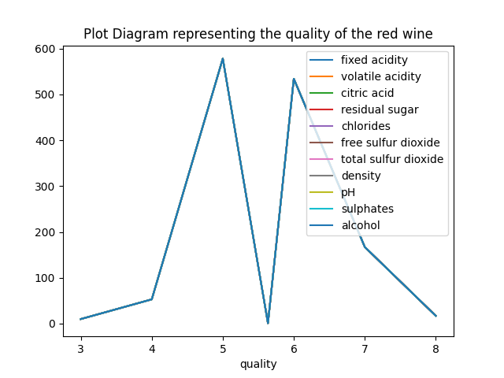
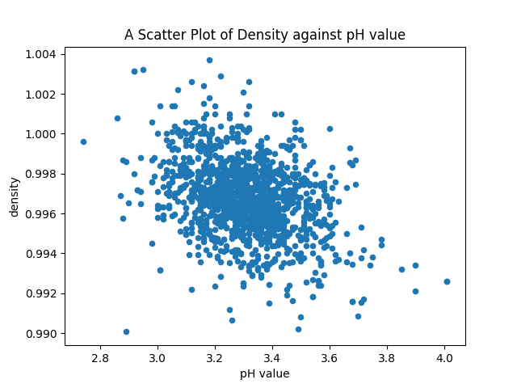
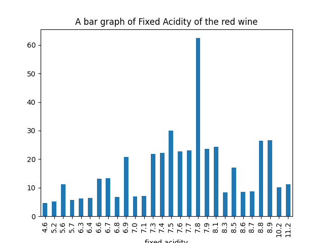
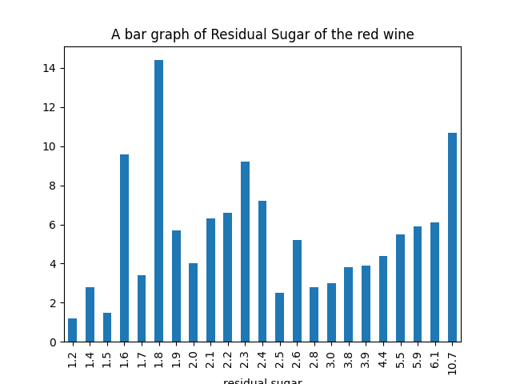

## __REPORT ON GRAPHS AND PLOTS OBTAINED FROM THE RED WINE.CSV__
---
### __Plot Diagram representing the quality of the red wine.__

This plot diagram represents the quality of the red wine. This plot diagram visualizes the relationship between the quality and the other properties of the red wine samples.
---
### __A Scatter Plot of Density against pH value.__

The scatter plot diagram shows that there is a negative linear relationship between the density and the pH of red wine, meaning that as the pH increases, the density decreases, and vice versa. This relationship is moderately strong, as the points are fairly close to a straight line. There are no obvious outliers or clusters in the data.
---
### __A bar graph of Fixed Acidity of the red wine of the first 60 rows.__

The bar graph shows that the distribution of the fixed acidity of red wine is skewed to the right, meaning that most of the wine samples have a low or medium fixed acidity, while few have a high fixed acidity. The most common fixed acidity is around 7.8. The lowest fixed acidity is around 4.6, and the highest is around 11.2.
---
### __A bar graph of Residual Sugar of the red wine of the first 50 rows.__

The graph shows that the residual sugar of residual sugar of red wines varies widely, ranging from 1.2 to 10.7 grams per litre. The majority of the samples have a residual sugar level of 1.8 grams per litre. Only few samples have a residual sugar level above 5 grams per litre.
---
